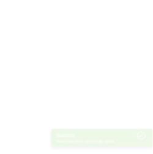

# ng-cool-notifier

> An easy notifications library for Angular

[]()

## Table of Contents

  - [Example](#example)
  - [Install](#install)
  - [Setup](#setup)
  - [Usage](#setup)
    - [Creating Notifications](#crating-notifications)
    - [Options](#options)

## Example

Soon

## Install

Install the library

```sh
npm install --save ng-cool-notifier
```

## Setup

Import the `CoolNotifierModule` in to your root `AppModule`
```ts
import { CoolNotifierModule } from 'ng-cool-notifier';

@NgModule({
    imports: [
        BrowserModule,
        CoolNotifierModule
    ],
    declarations: [AppComponent],
    bootstrap: [AppComponent]
})
export class AppModule { }
```

## Usage
Add the CoolNotifierComponent in to the component where you want to use the notifications. Or in your top level component for use in child components.
```js
...
template: '<cool-notifier></cool-notifier>'
...
```

You will also need to use the CoolNotifierService in your component to create or remove the notifications.
```js
...
constructor( private _service: CoolNotifierService ) {}
...
```

### Creating Notifications

| Method | Description
---| ---
`success(title?: any, content?: any, opts?: any)` | Creates a success notification with the provided title, content and options.
`error(title?: any, content?: any, opts?: any)`  | Creates an error notification with the provided title, content and options.
`alert(title?: any, content?: any, opts?: any)` | Creates an alert notification with the provided title, content and options.
`warn(title?: any, content?: any, opts?: any)` | Creates a warn notification with the provided title, content and options.
`info(title?: any, content?: any, opts?: any)` | Creates an info notification with the provided title, content and options.

### Options

This are the current options that can be set:

Option | Type | Default | Description |
------------ | ------------- | ------------- | -------------
__position__ | ["top" or "bottom" or "middle", "right" or "left" or "center"] | ["bottom", "right"] | Set the position on the screen where the notifications should display. Pass an array with two values example: ["top", "left"].
__timeOut__ | int | 0 | Determine how long a notification should wait before closing. If set to 0 a notification won't close it self.
__clickToClose__ | boolean | true | Determines if notifications should close on click.
__customClass__ | string | null | A class that should be attached to the notification. (It doesn't exactly get attached to the selector but to the first div of the template.)
__rtl__ | boolean | false | Adds the class `.rtl-mode` to the notification aligning the icon to the left and adding `direction: rtl`
__animate__ | "fade" or "fromTop" or "fromRight" or "fromBottom" or "fromLeft" or "scale" or "rotate" or null | "fromRight" | Choose the type of animation or set the value to null not to display animations.
__withIcon__ | boolean | true | Determines if notifications should show default icon

## License

MIT © [Mehdi Mecheri](mailto:mecherimehdi883@gmail.com)